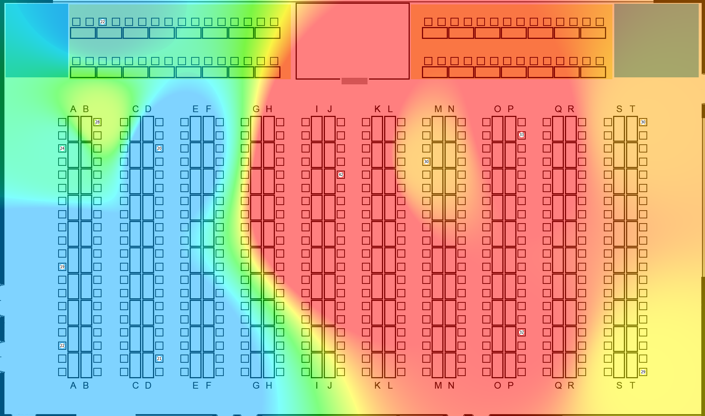

# CXT Heatmap

Der geneigte Besucher der [Convention-X-Treme](https://convention-x-treme) LAN-Party in Karlsdorf-Neuthard weiß, dass es vor Ort gerne mal heiß her geht.

<p align="center">

</p>

Um zu analysieren wie sich die Temperaturen über das LAN-Party-Wochenende entwickeln, wurde dieses Projekt geboren. Es besteht insgesamt aus vier Repositories:

- [cxt-heatmap](https://github.com/osiris86/cxt-heatmap)
- [cxt-heatmap-fe](https://github.com/osiris86/cxt-heatmap-fe)
- [cxt-heatmap-sensor](https://github.com/osiris86/cxt-heatmap-sensor)
- cxt-heatmap-data (dieses Repository)

<p align="center">

</p>

## CXT Heatmap Data

Dieses Repository ist ein Sammelbecken für die Daten. Es enthält außerdem Scripte mit deren Hilfe die Daten aufbereitet wurden.

In Zukunft soll es für die Auswertung der einzelnen LAN-Parties eigene Branches geben. Für den Moment gibt es nur die Auswertung der CXT26:

- [Convention-X-Treme 26: Jäger des verlorenen Internets](https://github.com/osiris86/cxt-heatmap-data/tree/CXT26)
- [Convention-X-Treme 28: Die Rückkehr der LAN Ritter](https://github.com/osiris86/cxt-heatmap-data/tree/CXT28)

## Daten auswerten

Um die Daten zu laden sollten die Ordner `influxdata` und `influxconfig` vom Server geladen werden. Eine lokale Instanz der InfluxDB sollte gestartet werden: `docker run --rm -p 8086:8086 -v ./influxdata:/var/lib/influxdb2 -v ./influxconfig:/etc/influxdb2 --env-file ./cxt-heatmap-data/.env influxdb:2.7.4`. Anschließend kann mit `npm run export` eine CSV-Datei mit allen gemessenen Temperaturen erstellt werden. Ein `npm run drawImages` erzeugt png-Dateien für den in `drawImages.ts` definierten Zeitraum. Derzeit pro 2 Minuten ein Bild.

Um ein paar Graphen aus den Daten zu erstellen, hilft Grafana. Hierzu am einfachsten einen lokalen Container von Grafana starten: `docker run --rm -p 3000:3000 --name=grafana grafana/grafana-enterprise`. Zugangsdaten: admin, admin. Anschließend die Influx-Connection hinzufügen und die Grafen wie gewohnt erstellen.
Hier ein paar Beispielabfragen ...

### Temperaturverlauf aller Sitzplätze

```
from(bucket: "cxt")
|> range(start: 0)
|> filter(fn: (r) => r._measurement == "temperature")
|> filter(fn: (r) => r["_value"] >= -1)
|> filter(fn: (r) => r["place"] != "Outside")
```

### Durchschnittstemperatur aller Sitzplätze

```
from(bucket: "cxt")
|> range(start: 0)
|> filter(fn: (r) => r._measurement == "temperature")
|> filter(fn: (r) => r["_value"] >= -1)
|> filter(fn: (r) => r["place"] != "Outside")
|> group()
|> aggregateWindow(every: 2m, fn: mean, createEmpty: false)
```

### Temperaturverlauf aller Sitzplätze inkl. Außentemperatur

```
from(bucket: "cxt")
|> range(start: 0)
|> filter(fn: (r) => r._measurement == "temperature")
|> filter(fn: (r) => r["_value"] >= -1)
```
