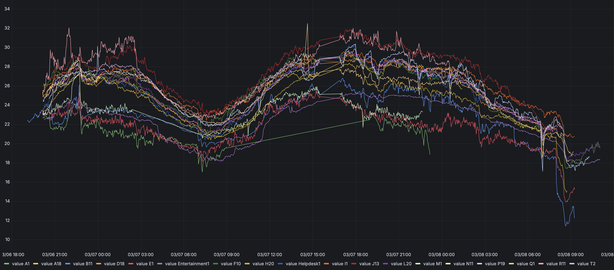
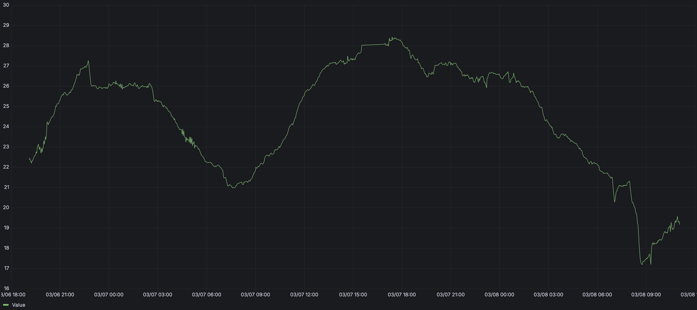
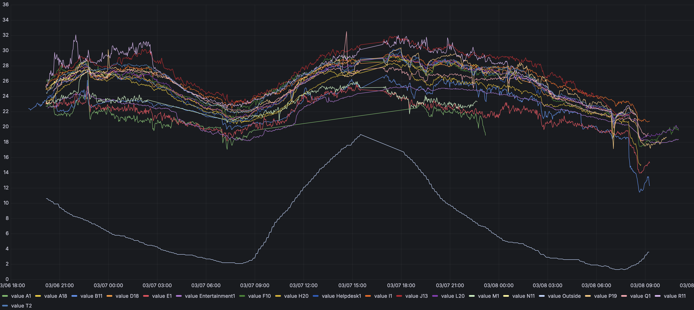

# Convention-X-Treme 28: Die Rückkehr der LAN Ritter

Die [Convention-X-Treme](https://convention-x-treme) fand in der 28. Ausgabe in der Altenbürghalle in Karlsdorf Neuthard statt. Die LAN Party begann am 06.03.2026 um 18:00 Uhr und endete am 08.03.2026 um 12:00 Uhr.

Nachdem beim letzten Einsatz ein Sensor nicht den Weg zu mir zurück gefunden hat, konnten 19 Sensoren an Gäste verteilt werden. Insgesamt 18 Sensoren wurden auch angeschlossen und haben regelmäßig Daten geliefert.

Die Sensoren waren so konfiguriert, dass sie alle 2 Minuten die aktuelle Temperatur gesendet haben. Außerdem wurde eine Netatmo Wetterstation nicht weit entfernt von der Halle per API angezapft, um auch die Außentemperatur zu erfassen.

Die meisten Daten hat der Sensor an Platz F10 geliefert (1.121 Datenpunkte), die wenigsten Daten kamen vom Platz N11 (120 Datenpunkte). Im Durchschnitt hat jeder Sensor 940 Temperaturen übermittelt; der Median lag bei 1.055.

Die Daten stehen in unterschiedlichen Formaten zur Verfügung:

- [CSV](https://github.com/osiris86/cxt-heatmap-data/blob/CXT26/data.csv)
- [InfluxDB](https://github.com/osiris86/cxt-heatmap-data/blob/CXT26/originalDb.zip)
- [PNGs](https://github.com/osiris86/cxt-heatmap-data/tree/CXT26/temperatureMaps)

## Einige Auswertungen

### Temperaturentwicklung

// Video to be added here

### Temperaturverlauf aller Sitzplätze

### Temperaturverlauf der Durchschnittstemperatur aller Plätze

### Temperaturverlauf aller Sitzplätze und der Außentemperatur

### Höchste gemessene Temperatur

36,56°C, gemessen am Samstag um 19:10:31 Uhr auf Platz C14. Es handelt sich um einen krassen Ausreisser. Die Messung davor um 19:05 Uhr lag bei 30,25°C, die um 19:20 Uhr bei 30,88°C.
Fun Fact: Die Körpertemperatur eines gesunden Menschen liegt zwischen 36 und 37°C. Verwendeter Temperatursensor wird fachgerecht entsorgt.

### Niedrigste gemessene Temperatur

18,81°C, gemessen am Sonntag um 08:22:34 Uhr auf Platz B16.

## Lessons Learned

- Die Nummerierung der Sitzplätze beginnt in Richtung der Umkleidekabinen und endet an der Bühne, nicht umgekehrt.
- Es sollte mehr Sensoren, gleichmäßiger verteilt werden. Evtl. vorher über die optimale Verteilung Gedanken machen und konkrete Kandidaten an der LAN ansprechen.
- Mehr Gedanken über die Platzierung der Sensoren machen, um vergleichbarere Messwerte an den unterschiedlichen Plätzen zu erhalten.
- Eine Temperaturskala einbauen.
- Die anfallende Datenmenge ist ziemlich klein. Die Sensoren können ihre Temperatur häufiger übermitteln.
- Bei der Erstellung der Heatmap sollte die Skala etwas grunalarer sein.
- Sensoren beschriften, damit Teilnehmer wissen wo sie zurückzugeben sind.

## Danksagung

Ein Dank geht raus an alle, die an ihrem Platz einen Sensor betrieben haben:

- Bowseer
- Brilliantix
- {UFC}Danomat
- Darkstar
- Der_Chris
- DRuNKeN_MaSTeR
- Kaczoland
- Kenichisonoda
- Pippolo
- [DKF]Prasselback
- Puggingtons

Besonderer Dank an **deto** vom Orga-Team, der mich bei der Umsetzung unterstützt hat und ebenfalls einen Sensor im Orga-Park betrieben hat.

Ein weiterer besonderer Danke an **veggie1996**, der die Gehäuse für die Sensoren gedruckt hat.
